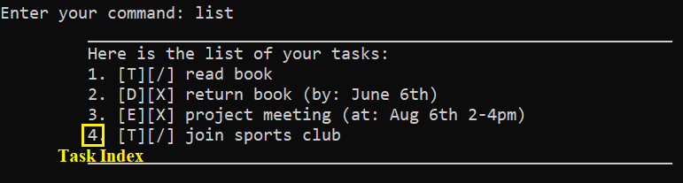

# Duke User Guide

## Table of Contents
1. [**Introduction**](#1-introduction)
1. [**Quick Start**](#2-quick-start)
1. [**Features**](#3-features)\
3.1. [Adding A Task : `todo`, `deadline`, `event`](#31-adding-a-task--todo-deadline-event)\
3.2. [Listing Tasks: `list`](#32-listing-tasks-list)\
3.3. [Marking A Task As Done: `done`](#33-marking-a-task-as-done-done)\
3.4. [Deleting A Task : `delete`](#34-deleting-a-task--delete)\
3.5. [Finding A Task : `find`](#35-finding-a-task--find)\
3.6. [Exiting Duke : `bye`](#36-exiting-duke--bye)
1. [**Command Summary**](#4-command-summary)

## 1. Introduction

Duke is for those who **prefer to use a desktop app for keeping track of tasks**.
More importantly, Duke is **optimised for the Command Line Interface** (CLI) which is beneficial if you can type fast.
If you have trouble tracking your deadlines and event dates, Duke can help you manage by saving your data into a file
and showing it when you start Duke again. Interested? Jump to the [Section 2. “Quick Start”](#2-quick-start) 
to get started!

## 2. Quick Start
1. Ensure you have Java `11` or above installed in your Computer.

1. Download the latest `duke.jar` [here]().

1. Copy the file to the folder you want to use as the home folder for Duke.

1. In the home folder for Duke, launch the jar file using the `java -jar duke.jar` command 
on Terminal (for macOS) or Command Prompt (for Windows) to start the app. 
If the setup is correct, you should see something like the below:
    ```
        ____________________________________________________________
        Hello dude! I'm Duke
        How can I help you?
        ____________________________________________________________
    ```

1. To use Duke, simply type a valid command into the terminal and press <kbd>Enter</kbd> to run the command.\
    Example: Typing `list` command and pressing <kbd>Enter</kbd> will list past tasks added to Duke.

1. Some example commands you can try:

    - `list` : Views all tasks added to Duke.
    - `deadline CS2113 Individual Project /by 2/10/2020 2359` : Adds a deadline called `CS2113 Individual Project`
    which is due on `2/10/2020 2359` to Duke.
    - `bye` : Exits Duke.

1. A summary of all the features available in Duke can be found in [Section 4. Command Summary](#4-command-summary).\
   Refer to [Section 3. "Features"](#3-features) for the detailed instructions of the various commands of Duke.  

## 3. Features 

---
**Command Format**

- Words that are in `UPPER_CASE` are the parameters to be supplied by you.\
Example: in `todo DESCRIPTION`, `DESCRIPTION` is a parameter which can be used as `todo CS2113 Team Meeting`.
- The `INDEX` used in various commands is a number specifying the order of a task in the tasks list.
This number can be found on the left of a task after running `list` command.
You can refer to [Section 3.2. Listing Tasks: `list`](#32-listing-tasks-list) to have more information about `list` command.\
Below is an example of Task Index:

    

- Dates that you input to Duke should follow the `D/M/YYYY` format.\
    Example: `1/10/2020` represents the date October 1st 2020.
- Time that you input to Duke should follow the `HHMM` format where `HH` is Hour in day (0-23)
and `MM` is Minute in hour (0-59).\
    Example: `1600` represents the time 16:59. 
--- 


### 3.1. Adding A Task : `todo`, `deadline`, `event`
Adds a task to Duke for tracking purposes.
There are 3 types of task that you can add to Duke:
- `todo` - a task with only a description.\
    Format: `todo DESCRIPTION`\
    Example of usage: `todo CS2113 Team Meeting`\
    Expected outcome:
    ```
         ____________________________________________________________
         Got it. I've added this task:
         [T][X] CS2113 Team Meeting
         Now you have 1 tasks in the list.
         ____________________________________________________________
    ```
  
- `deadline` - a task with a description and the deadline.\
    Format: `deadline DESCRIPTION /by DATE TIME`\
    Example of usage: `deadline CS2113 Individual Project /by 2/10/2020 2359`\
    Expected outcome:
    ```
         ____________________________________________________________
         Got it. I've added this task:
         [D][X] CS2113 Individual Project (by: 2 October 2020, 11.59PM)
         Now you have 2 tasks in the list.
         ____________________________________________________________
    ``` 
- `event` - a task with a description, the date and time of the event.\
    Format: `event DESCRIPTION /at DATE TIME`\
    Example of usage: `event Google Day 2020 /at 9/9/2020 1500`\
    Expected outcome:
    ```
         ____________________________________________________________
         Got it. I've added this task:
         [E][X] Google Day 2020 (at: 9 September 2020, 3.00PM)
         Now you have 3 tasks in the list.
         ____________________________________________________________
    ``` 

### 3.2. Listing Tasks: `list`
Lists all tasks in Duke with numbering according to the order they are added to Duke.

Format: `list`\
Expected outcome:
```
    ____________________________________________________________
    Here are the tasks in your list:
    1. [T][X] CS2113 Team Meeting
    2. [E][X] Google Day 2020 (at: 9 September 2020, 3.00PM)
    3. [D][X] CS2113 Individual Project (by: 2/10/2020)
    ____________________________________________________________
``` 

### 3.3. Marking A Task As Done: `done`
Marks a task in Duke as done.

Format: `done INDEX`\
Example of usage: `done 1`\
Expected outcome:
```
    ____________________________________________________________
    Nice! I've marked this task as done:
    [T][/] CS2113 Team Meeting
    ____________________________________________________________
``` 

### 3.4. Deleting A Task : `delete`
Deletes a task from Duke.

Format: `delete INDEX`\
Example of usage: `delete 2`\
Expected outcome:
```
    ____________________________________________________________
    Noted. I've removed this task:
    [E][X] Google Day 2020 (at: 9 September 2020, 3.00PM)
    Now you have 2 tasks in the list.
    ____________________________________________________________
``` 

### 3.5. Finding A Task : `find`
Finds tasks in Duke by searching for a keyword.

Format: `find KEYWORD`\
Example of usage: `find CS2113`\
Expected outcome:
```
    ____________________________________________________________
    Here are the matching tasks in your list:
    1. [T][/] CS2113 Team Meeting
    2. [D][X] CS2113 Individual Project (by: 2/10/2020)
    ____________________________________________________________
``` 

### 3.6. Exiting Duke : `bye`
Exits Duke.

Format: `bye`\
Expected outcome:
```
    ____________________________________________________________
    Bye buddy. Hope to see you again soon!
    ____________________________________________________________
``` 

## 4. Command Summary

Below is the summary of all the features available in Duke:

Action | Format, Examples 
|------|-----------------|
**Add** | - `todo DESCRIPTION`<br><br>Example: `todo CS2113 Team Meeting`<br><br>- `deadline DESCRIPTION /by DATE TIME`<br><br>Example: `deadline CS2113 Individual Project /by 2/10/2020 2359`<br><br>- `event DESCRIPTION /at DATE TIME`<br><br>Example: `event Google Day 2020 /at 9/9/2020 1500`
**List** | `list`
**Mark As Done** | `done INDEX`<br><br>Example: `done 1`
**Delete** | `delete INDEX`<br><br>Example: `delete 2`
**Find** | `find KEYWORD`<br><br>Example: `find CS2113`
**Exit** | `bye`
